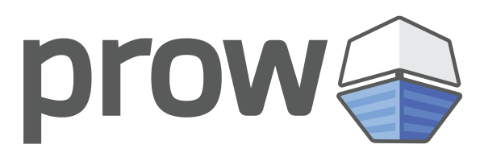

# Prow

The source code and statically generated docs for Prow live here. Historically Prow was developed in [kubernetes/test-infra](https://github.com/kubernetes/test-infra) along with other things, but the source code was moved here on April 9, 2024.

## Community, discussion, contribution, and support

Learn how to engage with the Kubernetes community on the [community page](http://kubernetes.io/community/).

You can reach the maintainers of this project at:

- [Slack](https://kubernetes.slack.com/messages/sig-testing)
- [Mailing List](https://groups.google.com/forum/#!forum/kubernetes-sig-testing)

### Code of conduct

Participation in the Kubernetes community is governed by the [Kubernetes Code of Conduct](code-of-conduct.md).
