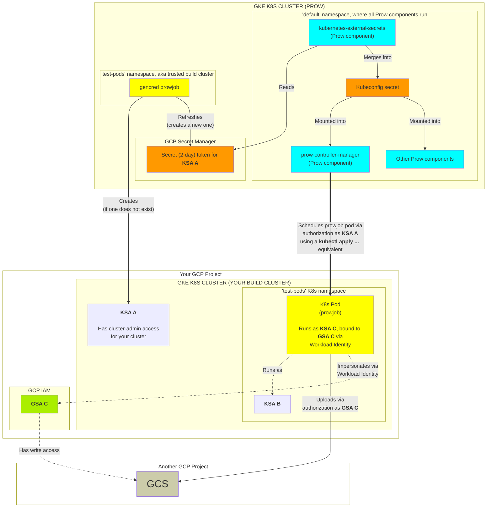

*Note: This page discusses build clusters that use GKE. Technically speaking, a
build cluster could be any Kubernetes cluster (not just GKE) because the only
thing Prow needs is the ability to authenticate as a Kubernetes Service Account
with cluster-admin role permissions to the build cluster.*

## Overview

By default Prow will schedule jobs in the cluster that maps to a kubeconfig
alias named "default" (imagine running `kubectl config set-context "default"
--cluster=<CLUSTER_CONTEXT>`, where the `<CLUSTER_CONTEXT>` could be any
cluster). So the jobs can be scheduled either in the same cluster that is
hosting Prow itself, or a different one. For example the "default" cluster
in [https://prow.k8s.io](https://prow.k8s.io) is the build cluster located in
the `k8s-prow-builds` GCP project and not the `k8s-prow` GCP project where the
Prow services actually run.

Setting up a separate build cluster will allow you to schedule jobs
into a different Kubernetes cluster altogether. When everything's set up, Prow's
component will schedule jobs into your build cluster (as shown in the
[Arhictecture diagram](../overview/architecture)) instead of its own. This way,
you can "bring your own build cluster" to Prow to make it scale however you see
fit.

For convenience we use the terms KSA and GSA, where **KSA** means **Kubernetes
Service Account** and **GSA** means **GCP (IAM) Service Account**.

## Running the build cluster setup script

The Prow source repo comes with a default
[create-build-cluster.sh](https://github.com/kubernetes/test-infra/blob/master/prow/create-build-cluster.sh)
script which allows you to create a new GKE cluster with the intent of giving
the [Kubernetes Prow instance](https://prow.k8s.io) access to it. Because there
are different Prow instances and each instance has its own default settings
(esp. for permissions), each instance has its own such script, forked from the
default one. For example, [Google's OSS Prow instance](https://oss.gprow.dev)
has its own script
[here](https://github.com/GoogleCloudPlatform/oss-test-infra/blob/master/prow/oss/create-build-cluster.sh).

The scripts all have prompts and ask you various questions to set everything up.
If everything proceeds smoothly, then there's nothing more for you to do (you're
ready to start writing Prow jobs that use your cluster). Below is a discussion
of the overall process to demystify what goes on behind the scenes.

## How does Prow actually use your build cluster?

There are two requirements:

1. Prow must be able to schedule jobs into your build cluster.
2. The jobs themselves must be able to upload artifacts to the GCS bucket used
by [Deck](../components/deck), in order to report job status (e.g., "passing" or
"failing").

We look at both requirements below.

### Let Prow schedule your jobs into your build cluster

Prow is a Kubernetes cluster. So is your build cluster. In order for Prow to
schedule jobs (i.e., create Kubernetes pods) into your build cluster, it must be
able to authenticate as a KSA[^1] defined in your build cluster that has a
[cluster-admin](https://kubernetes.io/docs/reference/access-authn-authz/rbac/#user-facing-roles)
Kubernetes role. This way, the `prow-controller-manager` component can
freely create, update, and delete jobs (pods) in your build cluster as
necessary. The item "KSA A" in the diagram below is this service account.

In order for Prow's components to authenticate as the cluster-admin KSA in your
build cluster, they use a token. You can think of this token simply as a
password, that when provided to your build cluster's API server along with the
KSA name, grants authentication as this very same KSA.

The question now turns to how we can generate this token. This can be done
manually, but the token cannot be valid for longer than 2 days for security
reasons (a GKE restriction), and must be rotated regularly. Fortunately, there
is a tool called `gencred` that automates the generation of the token. We just
need to have it be run periodically --- and so we need to add a Prow job that
regularly invokes `gencred`.

Once the token is generated, we can store it in the GCP Secret Manager for the
GCP project that is running Prow for safekeeping. Then we have to mount this
token into the various Prow components that need it; this one-way sync is
performed by the `kubernetes-external-secrets` component. The Prow components'
configurations don't have to be updated though, because your build cluster's
token is combined with other secrets into a composite file.

### Let your jobs report their status to GCS

Your jobs in your build cluster must have GCS access in order to upload critical
job metadata, such as a `finished.json` file to indicate the status of your job
(whether it passed or failed). The GCS bucket location usually depends on how
the Prow instance is configured. Currently they are:

| Prow instance          | GCS bucket                            |
|------------------------|---------------------------------------|
| https://prow.k8s.io/   | gs://kubernetes-jenkins [(source)][1] |
| https://oss.gprow.dev/ | gs://oss-prow [(source)][2]           |

You can also configure this to be a different bucket ([example](https://github.com/GoogleCloudPlatform/oss-test-infra/blob/d46723826c93a03f1d6e30d603bd5d0b0f723212/prow/oss/config.yaml#L138)).

In order to grant your job access to a GCS bucket, we'll use [Workload
Identity](https://cloud.google.com/kubernetes-engine/docs/how-to/workload-identity).

The basic steps to get GCS uploads working are:

1. Create `KSA B`
2. Create `GSA C`
3. Bind `KSA B` in the `test-pods` namespace to `GSA C` with Workload Identity.
4. Assign `KSA B` a Workload Identity annotation so that GKE knows to
   automatically run the "impersonate as GSA C" process when the prowjob
   Kubernetes pod starts in your build cluster.
   
Below is a diagram of all critical pieces between your build cluster and Prow,
once everything is set up and working.

[1]: https://github.com/kubernetes/test-infra/blob/6cea13a32eaa2de93d4c455fdc1e0585de9d7dd5/config/prow/config.yaml#L19
[2]: https://github.com/GoogleCloudPlatform/oss-test-infra/blob/cd6e6b4d391209be8d27f75700bcde227d6800e5/prow/oss/config.yaml#L124

[^1]: KSA is not a hard requirement; it's just an easier way to generate a kubeconfig for authenticating with a build cluster. The other method is via [creating a certificate](https://github.com/kubernetes/test-infra/blob/408f66a2a9199fbcaafc55aa35f72a49a06da26c/gencred/cmd/gencred/main.go#L236).
