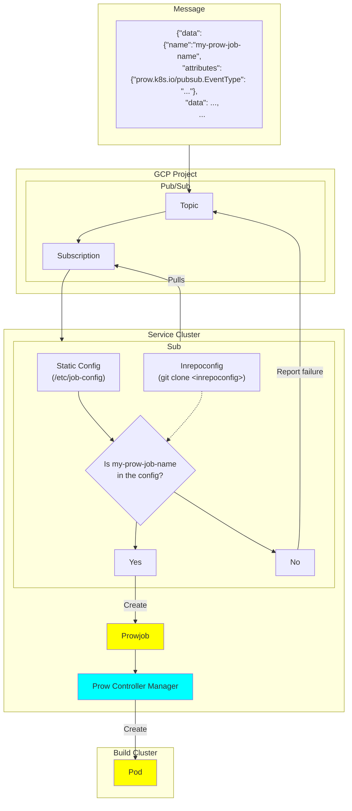

Sub is a Prow component that can trigger new Prow jobs (PJs) using Pub/Sub
messages.  The message does not need to have the full PJ defined; instead you
just need to have the job name and some other key pieces of information (more on
this below). The rest of the data needed to create a full-blown PJ is derived
from the main Prow configuration (or inrepoconfig).

## Deployment Usage

Sub can listen to Pub/Sub subscriptions (known as "pull subscriptions").

When deploy the sub component, you need to specify `--config-path` to your prow config, and optionally
`--job-config-path` to your prowjob config if you have split them up.


Notable options:
- `--dry-run`: Dry run for testing. Uses API tokens but does not mutate.
- `--grace-period`: On shutdown, try to handle remaining events for the specified duration.
- `--port`: On shutdown, try to handle remaining events for the specified duration.
- `--github-app-id` and `--github-app-private-key-path=/etc/github/cert`: Used to authenticate to GitHub for cloning operations as a GitHub app. Mutually exclusive with `--cookiefile`.
- `--cookiefile`: Used to authenticate git when cloning from `https://...` URLs. See `http.cookieFile` in `man git-config`.
- `--in-repo-config-cache-size`: Used to cache Prow configurations fetched from inrepoconfig-enabled repos.



### Sending a Pub/Sub Message

Pub/Sub has a [generic `PubsubMessage` type][pubsubMessage] that has the following JSON structure:

```json
{
  "data": string,
  "attributes": {
    string: string,
    ...
  },
  "messageId": string,
  "publishTime": string,
  "orderingKey": string
}
```

The Prow-specific information is encoded as JSON as the `string` value of the `data` key.

### Pull Server

All pull subscriptions need to be defined in Prow Configuration:

```
pubsub_subscriptions:
  "gcp-project-01":
  - "subscription-01"
  - "subscription-02"
  - "subscription-03"
  "gcp-project-02":
  - "subscription-01"
  - "subscription-02"
  - "subscription-03"
```

Sub must be running with `GOOGLE_APPLICATION_CREDENTIALS` environment variable pointing to the service
account credentials JSON file. The service account used must have the right permission on the
subscriptions (`Pub/Sub Subscriber`, and `Pub/Sub Editor`).

More information at https://cloud.google.com/pubsub/docs/access-control.

#### Periodic Prow Jobs

When creating your Pub/Sub message, for the `attributes` field, add a key
`prow.k8s.io/pubsub.EventType` with value
`prow.k8s.io/pubsub.PeriodicProwJobEvent`. Then for the `data` field, use the
following JSON as the value:

```json
{
  "name":"my-periodic-job",
  "envs":{
    "GIT_BRANCH":"v.1.2",
    "MY_ENV":"overwrite"
  },
  "labels":{
    "myLabel":"myValue",
  },
  "annotations":{
    # GCP project where Prow Job statuses are published by Prow. Must also
    # provide "prow.k8s.io/pubsub.topic" to take effect.
    #
    # It's highly recommended to configure this even if prowjobs are monitored
    # by other means, because this is also where errors are reported when the
    # jobs are failed to be triggered.
    "prow.k8s.io/pubsub.project":"myProject",

    # Unique run ID.
    "prow.k8s.io/pubsub.runID":"asdfasdfasdf",

    # GCP pubsub topic where Prow Job statuses are published by Prow. Must be a
    # different topic from where this payload is published to.
    "prow.k8s.io/pubsub.topic":"myTopic"
  }
}
```

_Note: the `#` lines are comments for purposes of explanation in this doc; JSON
does not permit comments so make sure to remove them in your actual payload._

The above payload will ask Prow to find and trigger the periodic job named
`my-periodic-job`, and add/overwrite the annotations and environment variables
on top of the job's default annotations. The `prow.k8s.io/pubsub.*` annotations
are used to publish job statuses.

_Note: periodic jobs always clone source code from ref (a branch) instead of a
specific SHA. If you need to trigger a job based on a specific SHA you can use a
[postsubmit job](#postsubmit-prow-jobs) instead._

#### Postsubmit Prow Jobs

Triggering presubmit job is similar to periodic jobs. Two things to change:

- instead of an attributes with key `prow.k8s.io/pubsub.EventType` and value
  `prow.k8s.io/pubsub.PeriodicProwJobEvent`, replace the value with `prow.k8s.io/pubsub.PostsubmitProwJobEvent`
- requires setting `refs` instructing postsubmit jobs how to clone source code:

```json
{
  # Common fields as above
  "name":"my-postsubmit-job",
  "envs":{...},
  "labels":{...},
  "annotations":{...},

  "refs":{
    "org": "org-a",
    "repo": "repo-b",
    "base_ref": "main",
    "base_sha": "abc123"
  }
}
```

This will start postsubmit job `my-postsubmit-job`, clones source code from `base_ref`
at `base_sha`.

(There are more fields can be supplied, see [full documentation](https://github.com/kubernetes-sigs/prow/blob/db89760fea406dd2813e331c3d52b53b5bcbd140/pkg/apis/prowjobs/v1/types.go#L1128))

#### Presubmit Prow Jobs

Triggering presubmit jobs is similar to postsubmit jobs. Two things to change:

- instead of an `attributes` with key `prow.k8s.io/pubsub.EventType` and value
  `prow.k8s.io/pubsub.PostsubmitProwJobEvent`, replace the value with `prow.k8s.io/pubsub.PresubmitProwJobEvent`
- for the `refs` field, additionally supply a `pulls` field, like this:

```json
{
  # Common fields as above
  "name":"my-presubmit-job",
  "envs":{...},
  "labels":{...},
  "annotations":{...},

  "refs":{
    "org": "org-a",
    "repo": "repo-b",
    "base_ref": "main",
    "base_sha": "abc123",
    "pulls": [
      {
        "sha": "def456"
      }
    ]
  }
}
```

This will start presubmit job `my-presubmit-job`, clones source code like pull requests
defined under `pulls`, which merges to `base_ref` at `base_sha`.

(There are more fields that can be supplied, see [full
documentation](https://github.com/kubernetes-sigs/prow/blob/db89760fea406dd2813e331c3d52b53b5bcbd140/pkg/apis/prowjobs/v1/types.go#L1128).
For example, if you want the job to be reported on the PR, add `number` field
right next to `sha`)

#### Gerrit Presubmits and Postsubmits

Gerrit presubmit and postsubmit jobs require some additional labels and
annotations to be specified in the pubsub payload if you wish for them to report
results back to the Gerrit change. Specifically the following annotations must
be supplied (values are examples):

```yaml
  annotations:
    prow.k8s.io/gerrit-id: my-repo~master~I79eee198f020c2ff23d49dbe4d2b2ef7cdc4091b
    prow.k8s.io/gerrit-instance: https://my-project-review.googlesource.com
  labels:
    prow.k8s.io/gerrit-patchset: "4"
    prow.k8s.io/gerrit-revision: 2b8cafaab9bd3a829a6bdaa819a18f908bc677ca
```

[pubsubMessage]: https://cloud.google.com/pubsub/docs/reference/rest/v1/PubsubMessage
