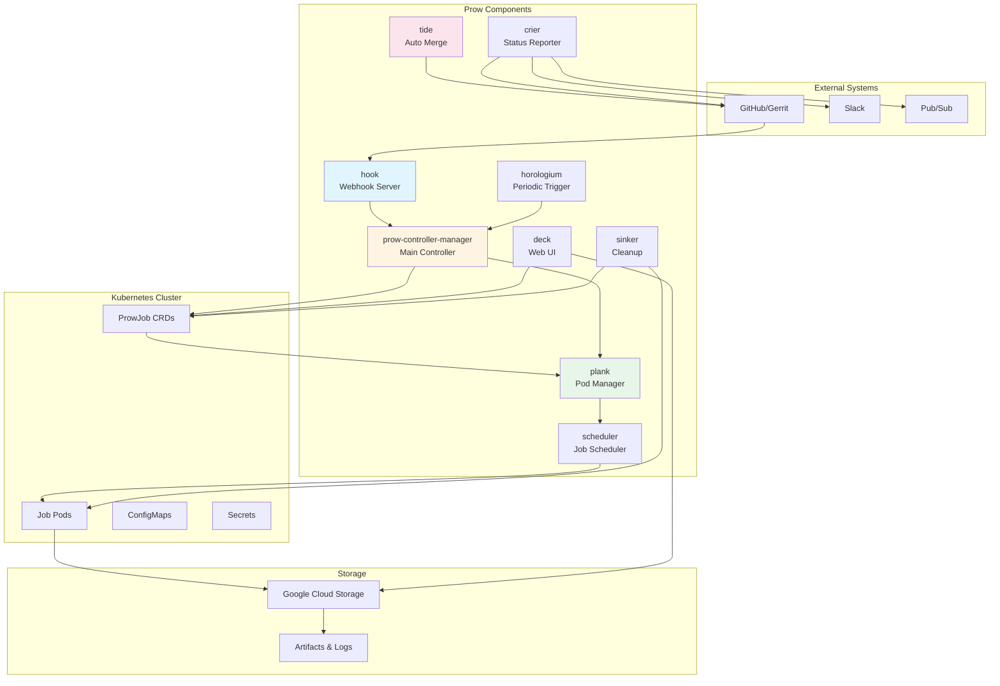
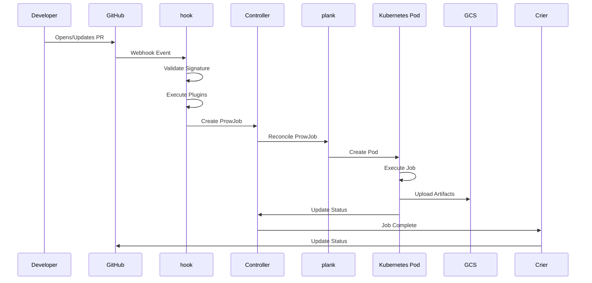
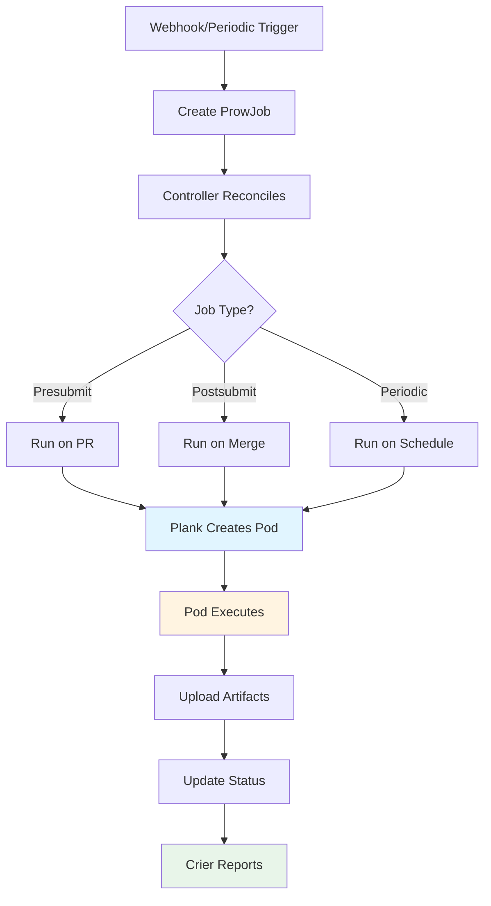
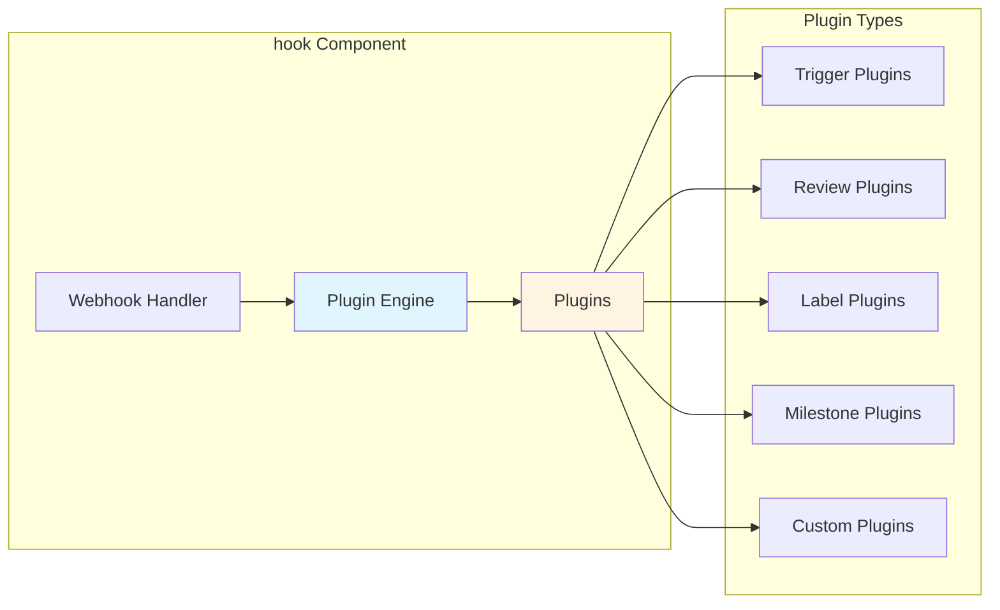
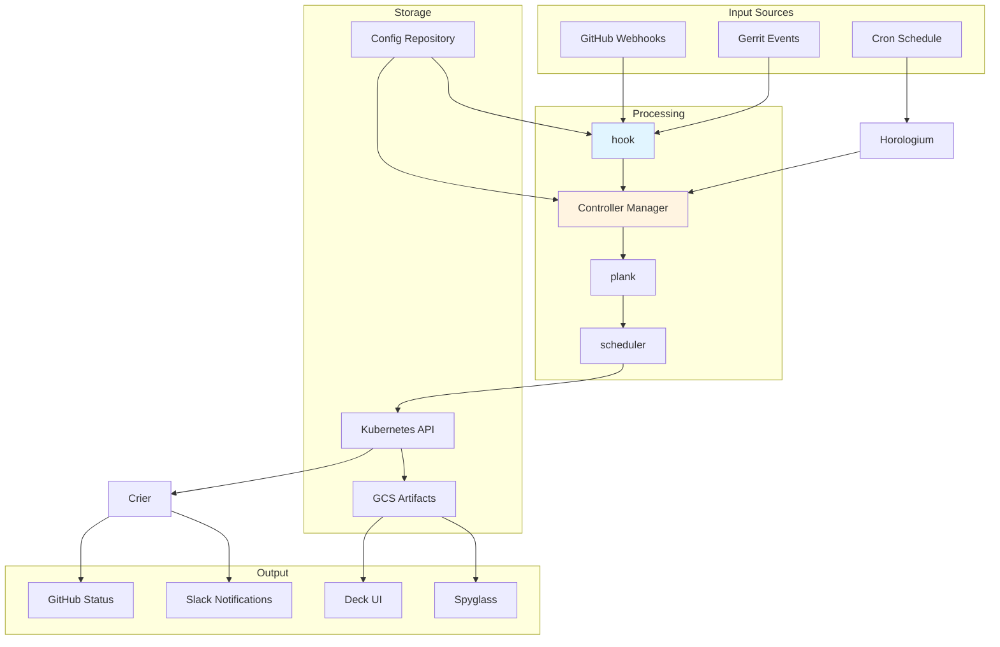
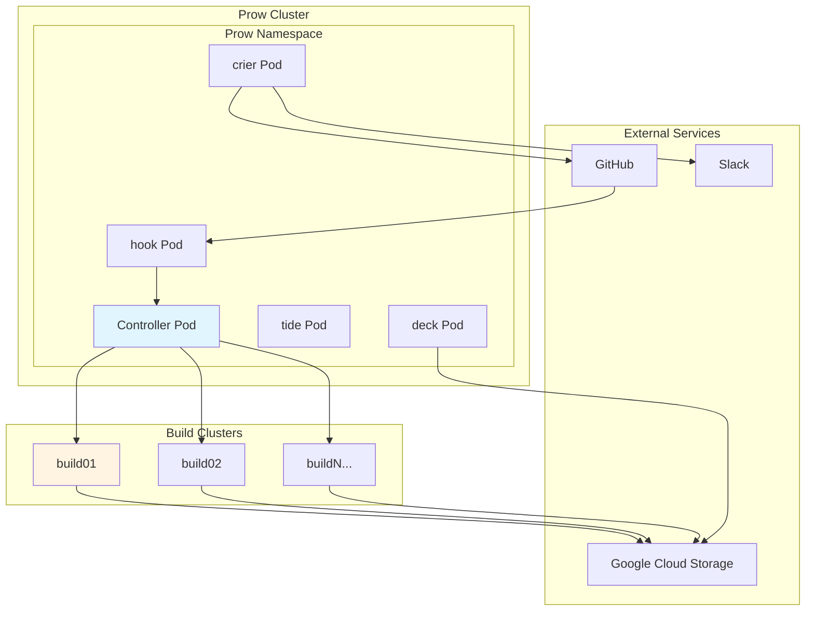
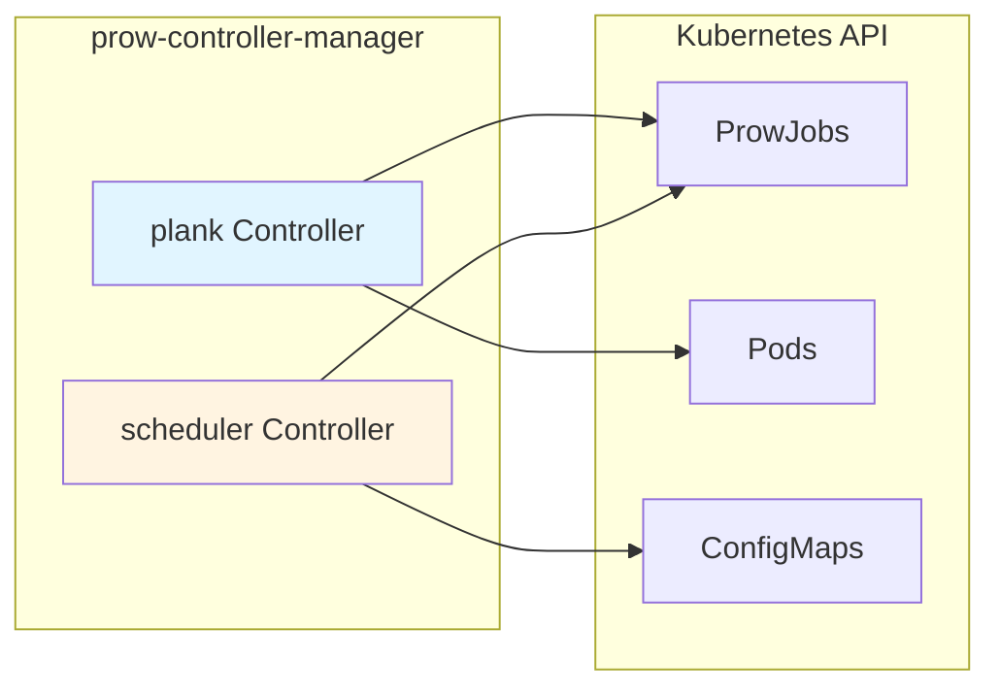
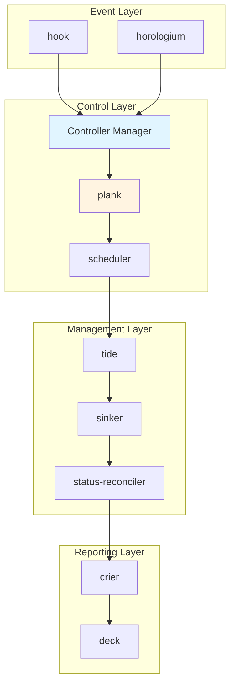
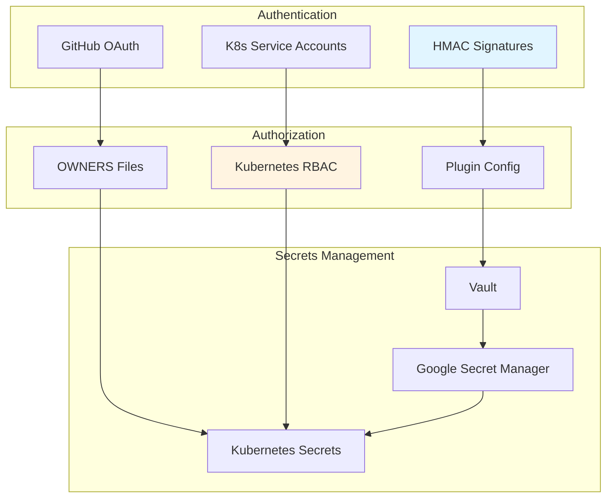
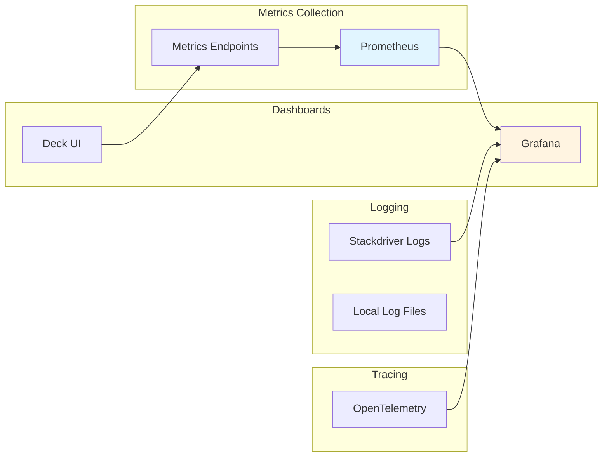

## Prow in a Nutshell

Prow creates jobs based on various types of events, such as:

- GitHub events (e.g., a new PR is created, or is merged, or a person comments
"/retest" on a PR),

- Pub/Sub messages,

- time (these are created by **Horologium** and are called **periodic** jobs),
and

- retesting (triggered by **Tide**).

Jobs are created inside the Service Cluster as Kubernetes Custom Resources.  The
**Prow Controller Manager** takes triggered jobs and schedules them into a build
cluster, where they run as Kubernetes pods. **Crier** then reports the results
back to GitHub.

## System Architecture

Prow is a Kubernetes-native CI/CD system that uses Kubernetes Custom Resources (ProwJobs) to manage CI/CD workflows. The architecture follows a microservices pattern where each component has a specific responsibility.

### High-Level Architecture Diagram

## Component Architecture

### Webhook Flow

### Job Execution Flow

### Plugin System Architecture

### Data Flow Diagram

## Deployment Architecture

### Production Deployment

### Controller Architecture

The prow-controller-manager runs multiple controllers:

## Component Interaction Diagram

## Key Design Patterns

### 1. Kubernetes Native
Prow uses Kubernetes Custom Resources (ProwJobs) to represent CI jobs:
- ProwJobs are Kubernetes resources
- Jobs execute as Pods
- Standard Kubernetes patterns (watches, informers)

### 2. Controller Pattern
Components follow the Kubernetes controller pattern:
- Watch for resource changes
- Reconcile desired state
- Handle errors and retries gracefully

### 3. Plugin Architecture
Extensible plugin system:
- Plugins are Go packages
- Hook loads and executes plugins
- Plugins can interact with GitHub, Kubernetes, etc.

### 4. Multi-Cluster
Support for distributing jobs across clusters:
- Cluster selection logic
- Per-cluster configurations
- Load balancing

### 5. Event-Driven
System responds to events:
- GitHub webhooks trigger jobs
- Periodic jobs triggered by cron
- Status updates trigger reporting

## Security Architecture

## Scalability Considerations

1. **Horizontal Scaling**: Components can be scaled horizontally
2. **Multi-Cluster**: Jobs distributed across multiple clusters
3. **Caching**: ghproxy caches GitHub API responses
4. **Resource Management**: Sinker cleans up old resources
5. **Efficient API Usage**: Informers and watches for Kubernetes API

## Monitoring and Observability

## Notes

Note that Prow can also work with Gerrit, albeit with less features.
Specifically, neither **Tide** nor **Hook** work with Gerrit yet.
