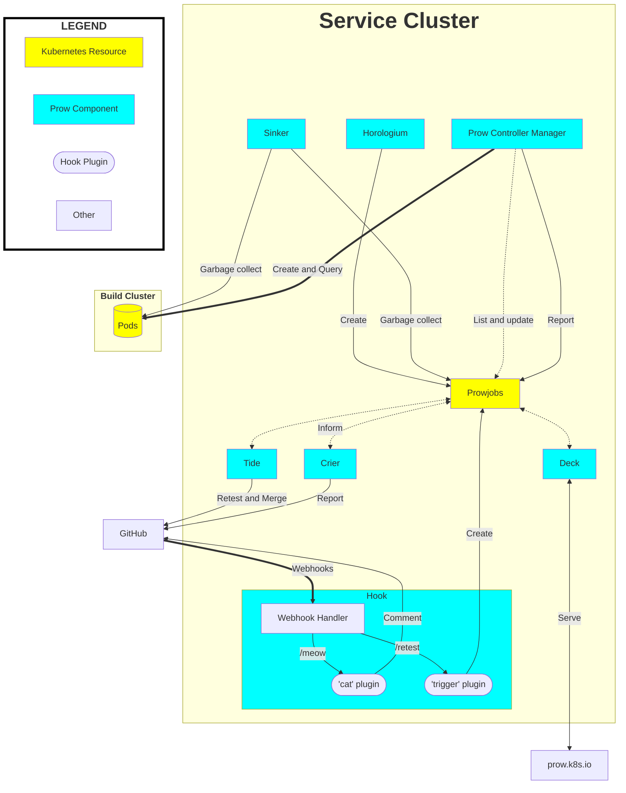

## Prow in a Nutshell

Prow creates jobs based on various types of events, such as:

- GitHub events (e.g., a new PR is created, or is merged, or a person comments
"/retest" on a PR),

- Pub/Sub messages,

- time (these are created by **Horologium** and are called **periodic** jobs),
and

- retesting (triggered by **Tide**).

Jobs are created inside the Service Cluster as Kubernetes Custom Resources.  The
**Prow Controller Manager** takes triggered jobs and schedules them into a build
cluster, where they run as Kubernetes pods. **Crier** then reports the results
back to GitHub.

## Required Tests and Branch Protection

The "Required" tests that appear in GitHub PRs are controlled by [GitHub branch protection](https://docs.github.com/en/repositories/configuring-branches-and-merges-in-your-repository/managing-protected-branches/about-protected-branches) rules. These are **not** Prow jobs themselves, but rather GitHub's enforcement of status checks that must pass before merging.

Prow can automatically configure these branch protection settings through the optional [**Branchprotector**](/docs/components/optional/branchprotector/) component, which:

* Configures GitHub branch protection based on Prow configuration
* Automatically adds required status checks for jobs with `always_run: true`
* Manages other branch protection settings like required reviews, admin enforcement, etc.

If you see mysterious "required tests" that you cannot `/test`, they are likely:
1. Configured explicitly in the `branch-protection` config section
2. Automatically derived from `always_run: true` Prow jobs
3. Set manually in GitHub's branch protection settings

See the [Branchprotector documentation](/docs/components/optional/branchprotector/) for details on configuration.

## Notes

Note that Prow can also work with Gerrit, albeit with less features.
Specifically, neither **Tide** nor **Hook** work with Gerrit yet.
